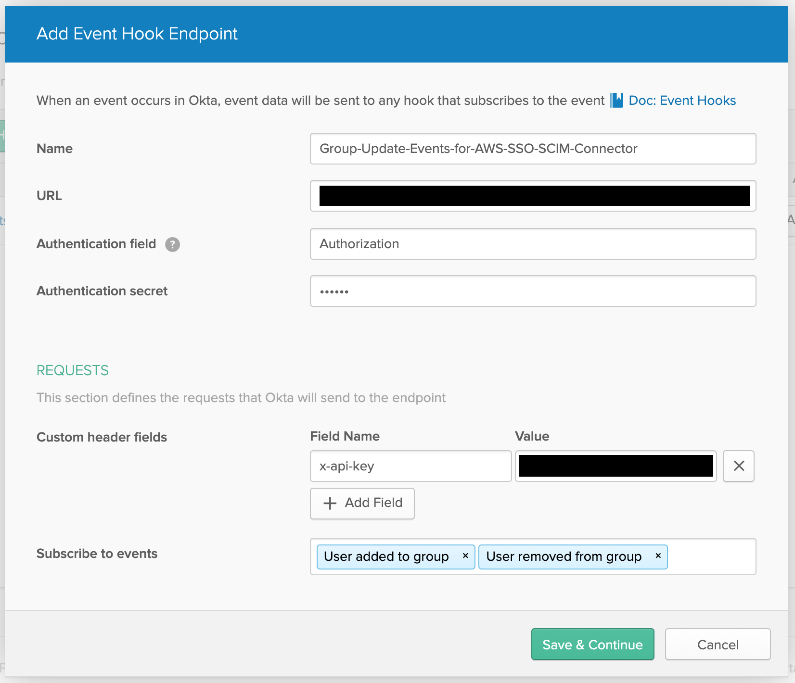

# NOTICE
There is now a working, native intgration between Okta and AWS SSO. Should you come across this repository, please use that integration instead. :smile:

Additionally, [AWS announced](https://aws.amazon.com/about-aws/whats-new/2020/09/aws-single-sign-on-adds-account-assignment-apis-and-aws-cloudformation-support-to-automate-multi-account-access-management/) AWS SSO related CloudFormation resources and administrative APIs on 2020-09-10.

----

# Okta AWS SSO SCIM Groups Connector <!-- omit in toc -->

- [What it Does](#what-it-does)
- [Why it Exists](#why-it-exists)
- [What it Does Not Do](#what-it-does-not-do)
- [Operational Considerations](#operational-considerations)
  - [Group Names](#group-names)
  - [Group Renames](#group-renames)
  - [Scalability](#scalability)
    - [Event Delivery Guarantees](#event-delivery-guarantees)
    - [Event Amalgamation](#event-amalgamation)
    - [Number of Users and Groups](#number-of-users-and-groups)
- [Infrastructure/Architecture](#infrastructurearchitecture)
- [Project Structure](#project-structure)
- [Deployment](#deployment)
  - [Deploying to AWS](#deploying-to-aws)
  - [Manage Your Secrets](#manage-your-secrets)
  - [Configuring an Event Hook in Okta](#configuring-an-event-hook-in-okta)
  - [Inspecting Logs (optional)](#inspecting-logs-optional)

# What it Does
This application listens to group membership events from Okta and synchronizes membership changes to identically named groups in AWS SSO which begin with the prefix `AWS_`. Changes are effected by interacting with the SCIM 2.0 endpoint provided by AWS SSO for automatic provisioning.

# Why it Exists
The company I work for ([BriteCore](https://www.britecore.com/)) utilizes Okta as our identity provider and wants to adopt AWS Single Sign-on (SSO) to simplify access and access management for our growing number of AWS accounts.

[AWS SSO supports SAML 2.0 IdPs and automated provisioning via SCIM][aws-sso-external-idp-docs], but unfortunately there's an issue with the SCIM provisioning between Okta and AWS SSO at this time (2020-04-11). Specifically, attempting to push group membership from Okta to AWS SSO results an error like the following.

> Failed on 03-26-2020 03:49:35PM UTC: Unable to update Group Push mapping target App group AWS_SecurityRO: Error while creating user group AWS_SecurityRO: Bad Request. Errors reported by remote server: Request is unparsable, syntactically incorrect, or violates schema.

This is particularly unfortunate because it is not possible to manage group membership directly in AWS SSO while SCIM provisioning is enabled. Disabling automatic provisioning and just using Okta as the IdP is an option, but one which comes with a big downside: managing user provisioning in two places. :frowning:

In speaking with AWS Support, I was informed that this is a known issue with a planned resolution. Unfortunately, but not unsurprisingly, only a rough timeline of 3-6 months from 2020-03-27 was available. Realizing SCIM is an open protocol and not wanting to wait an unknown amount of time for a fix, I decided to make my own. I also hope to help out [others facing the same issue][okta-support-forum-issue]. :smile:

[okta-support-forum-issue]: https://support.okta.com/help/s/question/0D51Y000081nHGTSA2/cannot-use-groups-push-with-aws-sso
[aws-sso-external-idp-docs]: https://docs.aws.amazon.com/singlesignon/latest/userguide/manage-your-identity-source-idp.html

# What it Does Not Do
This application **does not**:

  * Add/remove/update users in AWS SSO based on changes in Okta.
  * Add/remove groups in AWS SSO based on changes in Okta.
  * Syncrhonize group name/description changes in AWS SSO based on changes in Okta.

This is because:
 * The SCIM integration between AWS SSO and Okta works for the first two points.
 * Okta does not provide hookable events around group renames and description updates.

# Operational Considerations
I put this solution together quickly and in my spare time. My aim was to solve the general need, not solve the problem perfectly. I welcome contributions and will likely introduce a few improvements myself, but for now there are a few things you should keep in mind if you choose to utilize it yourself.

 ## Group Names
This application will only pay attention to group membership changes for groups beginning with the `AWS_` prefix. This prefix is not currently configurable.

## Group Renames

Renaming a group in Okta will break ongoing synchronization.

As noted in the [What it Does Not Do](#what-it-does-not-do) section, this application does not synchronize renames. As indicated in the [What it Does](#what-it-does) section, it only synchronizes group names which match exactly.

To work around this limitation, create a new group with the desired name (remember, it must start with `AWS_`), migrate all membership from the existing group to the new one, and then delete the old one.

 ## Scalability
   
While the underlying technology is scalable, I've conducted no significant load testing for this solution. 

### Event Delivery Guarantees
Okta events are delivered at least once and do not guarantee ordering. This could present an issue if the same user's presence in is rapidly changed in the same group. In this case, out of order or repeated executions could leave the membership in an undesired state.

Practically speaking, this is very unlikely to be an issue during normal use of this application for the following reasons:

  * Adding and removing a user from the same group are actions which are very likely to be temporally distanced enough from each other that ordering is preserved.
  * Adding/removing users is effectively idempotent when isolated from ordering issues.


### Event Amalgamation
Okta may amalgamate multiple events which occur temporally close together into a single event delivery. This application currently attempts to effect all changes indicated in a received event at the time of its receipt.

Currently, the Lambda function (and Okta) have a 3 second timeout in place which could be exceeded depending upon the number of events sent in a single notification. This problem is aggravated by the fact that AWS SSO's SCIM implementation does not currently allow batch changes.

In practice, I've not yet seen this be an issue, even when adding/remove a number of users to/from a group at the same time via Okta's UI.

### Number of Users and Groups
To gather sufficient information to generate the group membership patches, this application requests member and group listings from AWS SSO's SCIM API. To avoid dealing with pagination and the latency of multiple requests, it currently makes a request for the first 1000 users and 1000 groups. It does not handle multiple pages.

Practically, this means the application will not work in all cases if you have more than 1000 users or more than 1000 groups. It's also possible that latency could become problematic with large numbers of users or that there is an execution time error that will caues a request for such a large number of users/groups to fail.

The user directory I've used to test this application has around 250 users and less than 5 groups.


# Infrastructure/Architecture
This application's infrastructure is defined using [AWS SAM][]. It is fully serverless, written in Python, and intended to be deployed to the AWS Cloud. At this time, it is expected to be manually deployed using [AWS SAM CLI][] (see the [Deployment](#deployment) section).

At a high level:
 * [AWS Lambda][] is utilized for all compute.
 * [AWS API Gateway][] is used to define and host the API.
 * [AWS Secrets Manager][] is used to securely store/access secrets.
 * [AWS IAM][] is used to create an application specific policy and roles.

Please see [template.yaml](template.yaml) for more details regarding the infrastructure.

[AWS SAM]: https://docs.aws.amazon.com/serverless-application-model/latest/developerguide/what-is-sam.html
[AWS SAM CLI]: https://docs.aws.amazon.com/serverless-application-model/latest/developerguide/serverless-sam-cli-install.html
[AWS Lambda]: https://aws.amazon.com/lambda/
[AWS API Gateway]: https://docs.aws.amazon.com/apigateway/ 
[AWS Secrets Manager]: https://docs.aws.amazon.com/secretsmanager/
[AWS IAM]: https://docs.aws.amazon.com/iam/

# Project Structure
This is a simple application with a simple structure.

- [app](app/) - Code for the application's Lambda functions.
- [events](events/) - Invocation events that you can use to invoke the function.
- [tests](tests/) - Unit tests for the application code. 
- [template.yaml](template.yaml) - A template that defines the application's AWS resources.

>:notebook: **Note**
>
> Currently the `events/` and `tests/` directories contain only boiler plate files instantiated when this project was created from a template.

# Deployment
> :notebook: **Note**
>
> For the time being, the steps below are focused exclusively on deploying this application to AWS and configuring the needed event hook in Okta. They assume you have already:
>
> 1. Configured a SAML 2.0 application in Okta.
> 2. Configured AWS SSO to use Okta as its IdP.
> 3. Enabled SCIM provisioning in AWS SSO and Okta.
>    * You will also need the SCIM endpoint and access key provided during this process. The URL is retrievable at any time, but access keys are only provided at the time of creation.
>
> Please refer to the documentation [here (1)](https://controltower.aws-management.tools/infrastructure/sso/okta_sso/) and [here (2)](https://docs.aws.amazon.com/singlesignon/latest/userguide/provision-automatically.html) before beginning if you have not already taken these actions.

## Deploying to AWS

This application is defined using [AWS SAM][] and is currently intended to be manually deployed using [AWS SAM CLI][]. To deploy this application to your own AWS account, first do the following:

 1. [Install Docker][docker-install]
 2. Install Python 3 – Recommended: [Use pyenv and pyenv-virtualenv][install-python3]
 3. Install SAM CLI the SAM CLI – Recommended: `pip install aws-sam-cli` in your venv.

[docker-install]: https://hub.docker.com/search/?type=edition&offering=community
[install-python3]: https://github.com/pyenv/pyenv

With the above needs satisfied, run the following commands in your shell to deploy the application for the first time:

```bash
sam build --use-container
sam deploy --guided
```

The first command will build source of the application. The second command will package and deploy it to AWS following a series of prompts:

* **Stack Name**: The name of the stack to deploy to CloudFormation. This should be unique to your account and region.
* **AWS Region**: The AWS region where you want to deploy the application.
* **Parameter ScimUrl**: The SCIM url provided to you when you configured automatic provisioning in AWS SSO.
* **Confirm changes before deploy**: If set to yes, any change sets will be shown to you before execution for manual review. If set to no, the AWS SAM CLI will automatically deploy application changes.
* **Allow SAM CLI IAM role creation**: The SAM template for this application creates IAM roles, so you will need to allow SAM CLI to create IAM roles.
* **Save arguments to samconfig.toml**: If set to yes, your choices will be saved to a configuration file inside the project, so that in the future you can just re-run `sam deploy` without parameters to deploy changes to your application.

You can find your API Gateway Endpoint URL in the output values displayed after deployment. Take note of it as you'll need it to configure an event hook in Okta. You'll also need to retrieve the value of the API it created from AWS API Gateway.

## Manage Your Secrets
Navigate to the secret created by the deployment (it's named `app/okta-aws-sso-scim-groups-connector`) and retrieve the secret value. In plain text, it should look like the following:

```json
 {
   "aws_sso_scim_key": "<MUST BE PROVIDED>",
   "auth_token_for_okta": "<a 256 character generated string>"
 }
```

To proceed:
1. Take note of the `auth_token_for_okta`; you'll need it to configure Okta.
2. Input the SCIM access key/token as the value for `aws_sso_scim_key`.

## Configuring an Event Hook in Okta
Please follow the instructions in [Okta's documentation](https://console.aws.amazon.com/secretsmanager/home?region=us-east-1#/secret?name=app%2Fokta-to-aws-sso).

As depicted below, you'll need to provide the following inputs:

1. **Name**: This can be anything you want.
2. **URL**: This is the SCIM endpoint URL provided by AWS SSO when configuring automatic provisioning.
3. **Authentication field**: You must use 'Authorization'
4. **Authentication secret**: The value found in `auth_token_for_okta`.
5. **Custom header fields**: Add `x-api-key` and set the API key as its value.
6. **Subscribe to events**: Subscribe to 'User added to group' and 'User removed from group'.



If your event hook verifies successfully, everything should be working. 

## Inspecting Logs (optional)
SAM CLI has a command called `sam logs`. The `sam logs` command lets you fetch logs generated by a deployed Lambda function from the command line.

`NOTE`: This command works for all AWS Lambda functions; not just the ones you deploy using SAM.

You can find more information and examples about filtering Lambda function logs in the [SAM CLI Documentation](https://docs.aws.amazon.com/serverless-application-model/latest/developerguide/serverless-sam-cli-logging.html).
